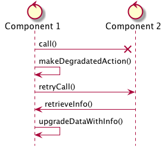

# Microservice Sandbox 

This Sandbox use a simplified version of an Insurance Claim System.

## Architecture Diagram
Those diagrams are freely inspired from the C4 model from Simons.

### Systems

### Components

## Use Cases
I want to show precises use cases through those projects

* Synchronous call with gentle degradation

* Long business transaction through multiple microservices enduring failure

## TODO's
* Service discovery with Spring Cloud Eureka
* Security with Spring Security
  * JWT
* Distributed Configuration
  * Spring-Cloud-Config
* Use Kubernetes to deploy all the components
  * Use Secret in Kubernetes
  * Use Secret in Spring-Cloud-Config
  * Use Helm ?
* Use Flyway and Liquibase to migrate database
* Use different types of database
* Migrate to Kotlin
* Migrate to Spring-Boot 2
  * Use Async Webflux
* Testing
  * Pact
  * HoverFly or Wiremock
* Monitor
  * Metrics
  * JHispter Console
* Deployment
  * Use DockerHub to deploy Container
  * Use Minikub in local to Deploy
  * Jenkins pipeline as Code
* Use Hibernate Search in Partner to find partner by name or forname
