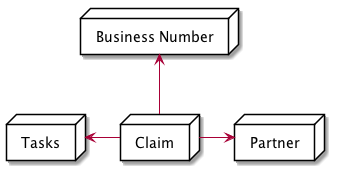
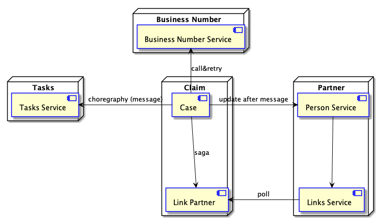

# Microservice Sandbox 

This Sandbox use a simplified version of an Insurance Claim System.

## Architecture Diagram
Those diagrams are freely inspired from the C4 model from Simon Brown.

### Systems

### Components

## Use Cases

- Create a Partner in the dedicated system
- Create a Case linked to a Partner, the Case should received a Business Number
- When a Case is created, a Task should appear to remind me to treat the Case
- Change the Business ID of a Partner (the change should cascade to the Claim domain)
- Interrogate the Claim system and show a Case with all the information of the related partner
- Once the Case closed, the related Task should closed too (event)

### NFRs
- Every call should be tracked with a CorrelationID
- Every sent event should be resendable
- All system should be idempotent (multiple messages delivery)

## Techological show cases

* Synchronous call with gentle degradation (cache)
* Long business transaction through multiple microservices enduring failure (Sagas)
* Synchronous call with retry
* Communication with messages (Choreography/Broker)
* Communication with messages (Polling)

## TODO's

- [x] Make a todo list ;-)
- [x] Implement VO's for insured and PNummer
- [x] Add TravisCI configuration
- [x] Add SonarQube analysis to the build
- [x] Add Spring-Boot Application to Case to run it and test via rest interface
- [x] Create docker-compose file to run Case and its DB inside containers
- [x] Implement Business Number provider
- [x] Make Business Service running in a container
- [x] Fix build travis
- [x] Create Partner service
- [x] Create a Person frontend with Angular, Jest tested and CDC test with pact
- [x] Add frontend build to the maven build of person
- [ ] Make all the docker image deploy to DockerHub
- [ ] Refactor all the docker compose yaml files to use Dockrhub images
- [ ] Add error to Rest API test and have a standard to propagate this error
- [x] Add pact test in infra-data-rest for BusinessNumber endpoint
- [ ] Add an endpoint in BNS to return PNumber format id
- [ ] Add birth date in person api signature
- [ ] Add partner info to Case microservice and enable update threw messaging
- [ ] Add Sonar analysis of person-frontend typescript the report on SonarCloud
- [ ] Create screens for person : search, list and create and corresponding Rest API
- [ ] Secure the creation of a partner behind a role and protect the endpoint
- [ ] Make person Service running in a container
- [x] Add partner info (Name, Forename, BirthDate)
- [ ] Refactor Case architecture to the Person one
- [ ] Create the claim link service
- [ ] Create polling service
- [ ] Create a base module (commons?) gathering all the interfaces and base classes 
- [ ] Add call context for all rest calls
- [ ] Add Call context for all logging
- [ ] Add a message broker (Kafka)
- [ ] Put in place the calls tracking system (Jhipster console)
- [ ] Finish messaging implementation (including Call Context)
- [ ] Create the task service (link with messages)
- [ ] Make the partner number change cascade to Case
- [ ] Make the documentation with Structurizr
- [ ] Implement ArchUnit Test

## Things to explore
* Service discovery with Spring Cloud Eureka
* Call tracking with :
  * Zipkin
  * Istio
  * Jhipster console
* Security with Spring Security
  * JWT
* Distributed Configuration
  * Spring-Cloud-Config
* Use Kubernetes to deploy all the components
  * Use Secret in Kubernetes
  * Use Secret in Spring-Cloud-Config
  * Use Helm ?
* Use Flyway and Liquibase to migrate database
* Use different types of database
* Migrate to Kotlin
* Migrate to Spring-Boot 2
  * Use Async Webflux
* Testing
  * Pact
  * HoverFly or Wiremock
* Monitor
  * Metrics
  * JHispter Console
* Deployment
  * Use DockerHub to deploy Container
  * Use Minikub in local to Deploy
  * Jenkins pipeline as Code
* Use Hibernate Search in Partner to find partner by name or forname
