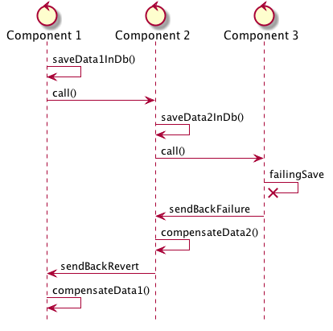

# Microservice Sandbox 

## Architecture Diagram
Those diagrams are freely inspired from the C4 model from Simons.

### Systems
[plantuml]
....
skinparam node {
    BackgroundColor light
    ArrowColor blue
}
skinparam note {
    BackgroundColor light
    BorderColor blue
}
node "Business Number" as bn
node "Partner" as pdv
node "Prestations" as main
node "Tasks" as tasks
node "Input Management" as im

main -up-> bn
main -left-> pdv
main -down-> tasks
main -> im
....

### Components
[plantuml]
....
skinparam componentStyle uml2
skinparam component {
    ArrowColor black
    BorderColor blue
}
node "Business Number" as bn {
    [Business Number Service] as bns
}
node "Partner" as pdv {
    [Person Service] as ps
    [Links Service] as ls

    ps -> ls
}
node "Tasks" as tasks {
    [Tasks Service] as ts
}
node "Input Management" as im {
    [Input Service] as is
}
node "Prestations" as main {
    [Announce] as a
    [Case] as c
    [Link Partner] as lp

    a -> c
    a -> bns
    a -> ps
    a -> ts
    c -> lp
    a -> lp
    lp <- ls
    a -> is
    c -> ts
    c -> bns
    c -> ps
}
....

## Use Cases
I want to show precises use cases through those projects

* Synchronous call with gentle degradation

[plantuml]
....
hide footbox
control "Component 1" as c1
control "Component 2" as c2

c1 -X c2 : call()
c1 -> c1 : makeDegradatedAction()
c1 -> c2 : retryCall()
c1 <- c2 : retrieveInfo()
c1 -> c1 : upgradeDataWithInfo()
....

* Long business transaction through multiple microservices enduring failure

## TODO's
* Service discovery
* Security
  * JWT
* Distributed Configuration
  * Spring-Cloud-Config
* Use Kubernetes to deploy all the components
  * Use Secret in Kubernetes
  * Use Secret in Spring-Cloud-Config
  * Use Helm ?
* Use Flyway and Liquibase to migrate database
* Use different types of database
* Migrate to Kotlin
* Migrate to Spring-Boot 2
  * Use Async Webflux
* Testing
  * Pact
  * HoverFly or Wiremock
* Monitor
  * Metrics
  * JHispter Console
* Deployment
  * Use DockerHub to deploy Container
  * Use Minikub in local to Deploy
  * Jenkins pipeline as Code
